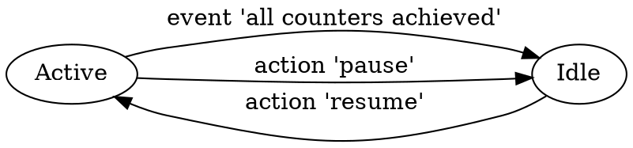
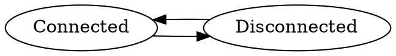

# Development information

## Schemes

### Torrent states

```graphviz
digraph Peer {
    rankdir=LR
    Active -> Idle [label = "event 'all counters achieved'"]
    Active -> Idle [label = "action 'pause'"]
    Idle -> Active [label = "action 'resume'"]
}
```

### Peer states

```graphviz
digraph Peer {
    rankdir=LR
    size="8,5"
    Connected -> Disconnected -> Connected
}
```
