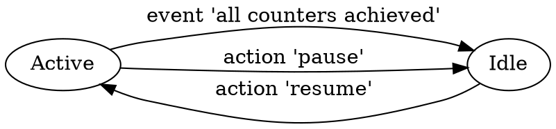
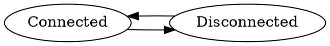

# Development information

## Schemes

### Torrent states

### Peer states

## Processes

### Downloader

This process is a loop to react on download events, select new blocks for download and update counters.

### Peer

Each peer is running its own processing stream.
